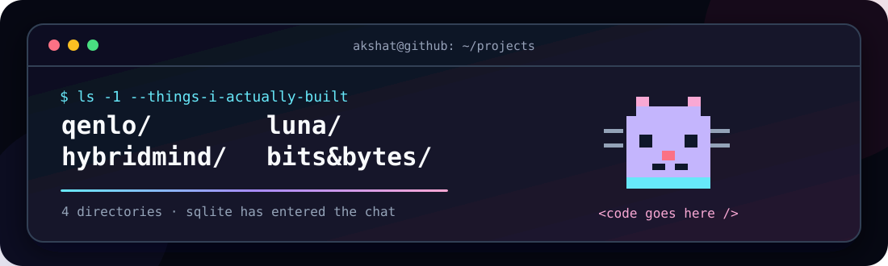

<p align="center">
  
</p>

<p align="center">
  <a href="#-qenlo"><code>qenlo</code></a>
  <a href="#-hybridmind"><code>hybridmind</code></a>
  <a href="#-luna"><code>luna</code></a>
  <a href="#-bitsbytes"><code>bits&amp;bytes</code></a>
</p>

## `$ git log --projects`

### / qenlo

[`github.com/a3ro-dev/qenlo`](https://github.com/a3ro-dev/qenlo) · `rust` `wgpu` `local-first`

an embedded vector store for software that wants durable records and exact cosine search without running a separate database service.

```text
app writes
   └─> canonical local store
          └─> metadata filter
                 ├─> exact CPU
                 ├─> WGPU
                 └─> USearch / PyTorch
```

atomic mutations, deterministic ordering, explicit fallback diagnostics, and SDKs for Rust, Python, TypeScript, Go, Kotlin, and Swift. the accelerated indexes are rebuildable; the records aren't disposable.

---

### / hybridmind

[`github.com/a3ro-dev/hybridmind`](https://github.com/a3ro-dev/hybridmind) · `python` `faiss` `bm25s` `networkx`

agent memory with three independent ways to find the same fact: meaning, exact words, and relationships.

```text
query
  ├─> dense vectors ─┐
  ├─> lexical BM25 ──┼─> weighted RRF ─> evidence
  └─> typed graph ───┘
```

bitemporal SQLite/WAL stays authoritative while runtime indexes can be rebuilt. portable `.mind` snapshots are checksummed, and 390+ offline tests make sure the retrieval layer doesn't quietly phone home.

---

### / luna

[`github.com/a3ro-dev/luna`](https://github.com/a3ro-dev/luna) · `next.js` `postgres` `ai-sdk` `openui`

a cycle companion you talk to like a person. no spreadsheet-shaped ritual before the software becomes useful.

```text
plain conversation
   └─> 10 focused tools
          ├─> cycle history + memory
          ├─> adaptive prediction
          └─> cards, calendars, phase maps
```

the prediction engine blends ACOG cold-start priors with adaptive exponential smoothing and soft outlier clamps. Supermemory carries context between sessions; OpenUI turns the result into something less grim than a row of database fields.

---

### / bits&bytes

[`github.com/gobitsnbytes/bitsnbytes`](https://github.com/gobitsnbytes/bitsnbytes) · `next.js` `react` `supabase` `rag`

the public web surface for a student-run builder network: events, applications, chapters, and the odd machinery needed to keep all of it moving.

```text
visitor + current route
          └─> site content + vector search
                       └─> useful answer / next action
```

the same app holds the event archive, membership flow, brand system, and a route-aware assistant backed by Supabase. small team, one codebase, fewer mysterious handoffs.

<p align="center">
  <sub><code>// eof. open the repos; that's where the work is.</code></sub>
</p>
